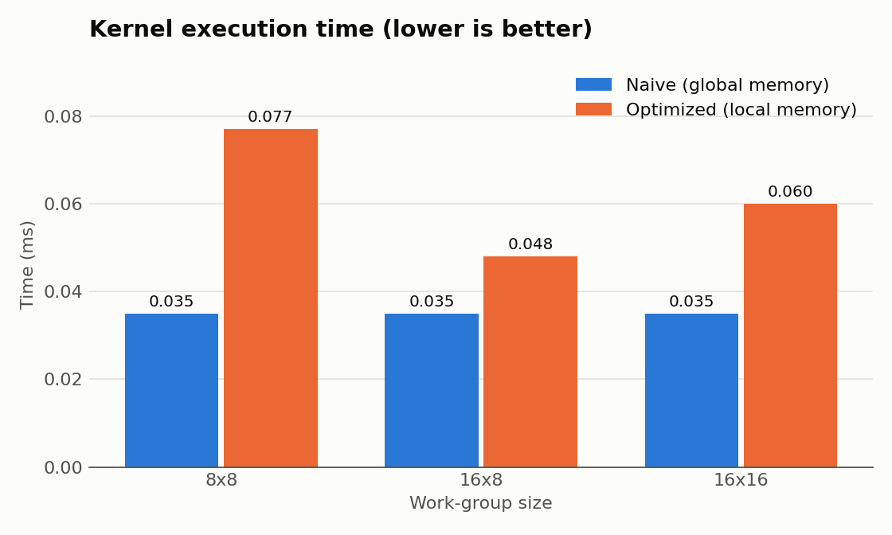
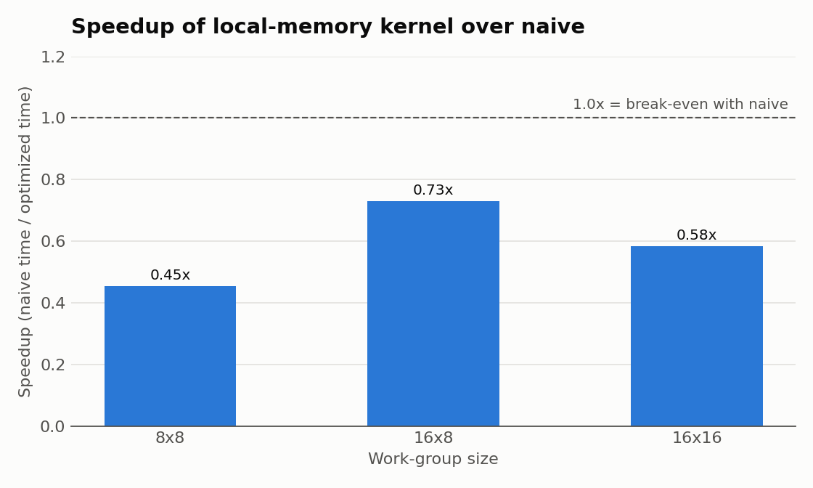

# OpenCL 3×3 Convolution: Global vs Local Memory

This project applies a 3×3 **Gaussian blur** to a **2048 × 2048** grayscale image with OpenCL. It compares two kernels:

| Version | Kernel | Memory strategy |
|---|---|---|
| **Naive** | `gaussian_blur_simple` ([naive_kernel.cl](naive_kernel.cl)) | Each work-item reads its 9 neighbours directly from **global memory**. |
| **Optimized** | `gaussian_blur_local` ([opt_kernel.cl](opt_kernel.cl)) | Each work-group loads its image tile plus a 1-pixel halo into **`__local` memory**, synchronizes with `barrier(CLK_LOCAL_MEM_FENCE)`, then convolves from the tile. |

The project uses only standard C++ and OpenCL. It uses no CUDA and no image-processing libraries. The input is a generated 2048 × 2048 `float` checkerboard (32 px squares), which stands in for image file I/O.

## Filter

Both kernels use the same normalized Gaussian weights and wrap around at the image edges:

```
        | 1  2  1 |
1/16 ×  | 2  4  2 |
        | 1  2  1 |
```

## Results

**Test device:** Apple M1 GPU (max work-group size 256)  
**Timing:** OpenCL event profiling (`CL_PROFILING_COMMAND_START` → `END`), kernel execution only

### Execution time

| Work-group | Naive (ms) | Optimized (ms) | Speedup (naive / optimized) |
|:---:|:---:|:---:|:---:|
| 8 × 8   | 0.035 | 0.077 | **0.45×** |
| 16 × 8  | 0.035 | 0.048 | **0.73×** |
| 16 × 16 | 0.035 | 0.060 | **0.58×** |



### Speedup from local memory



> **Finding:** On the M1, the local-memory kernel was **slower** than the naive kernel at every work-group size tested (0.45×–0.73×). The best configuration for the optimized kernel was **16 × 8**.

32 × 32 (1024 work-items) was not tested. It exceeds the M1's 256 work-item limit per work-group, and the optimized kernel's local tile is fixed at `18 × 18` (16 × 16 + halo).

## Analysis

### Memory access patterns

- **Naive:** 9 global reads per output pixel. Neighbouring work-items read overlapping pixels, so there is a lot of redundant traffic. No synchronization is needed.
- **Local memory:** each input pixel is read from global memory about once per tile (plus the halo). The 9 neighbour reads then come from fast on-chip memory. The cost is extra index arithmetic, branching for the halo loads, and a barrier.

### Why the "optimized" kernel is slower here

1. **Hardware caching.** The M1's GPU caches global reads well. A 3×3 stencil has excellent spatial locality, so most of the naive kernel's "redundant" reads already hit in cache.
2. **Barrier and load overhead.** A 3×3 filter does very little arithmetic per pixel. The cost of the cooperative tile load and `barrier()` is larger than the global traffic it saves.
3. **Unbalanced halo loading.** Only edge work-items load halo pixels, and corner work-items do up to 4 extra loads. Other work-items sit idle while these finish.
4. **Very short kernels.** Each run takes only tens of microseconds, so fixed launch and scheduling costs are a large part of the measured time.

### Effect of work-group size

- **8 × 8** was the slowest configuration (0.077 ms). Small tiles have a poor interior-to-halo ratio: 64 pixels computed per 100 loaded. There are also 4× more work-groups than at 16 × 16, and therefore more barriers.
- **16 × 8** was the fastest configuration (0.048 ms). It has a better halo ratio, and its wider rows give more coalesced row loads. At 128 work-items, several groups can stay resident per compute unit.
- **16 × 16** (0.060 ms) has the best halo ratio, but each 256-item group uses the device maximum. That limits occupancy and makes each barrier wait on more work-items.
- The **naive kernel is unaffected** by work-group size (0.035 ms in all cases) because it does no cooperative work.

## Build & run

**Requirements:** a C++17 compiler and an OpenCL 1.2+ runtime and headers (macOS: built in; Linux: `ocl-icd-opencl-dev` plus a vendor driver).

```bash
make          # builds ./convolution
make run      # runs the benchmark (the .cl files must be in the working directory)
```

The program prints device information, a timing table for both kernels at each work-group size, the fastest configuration, and the speedup.

To regenerate the charts from the timings in [scripts/plot_results.py](scripts/plot_results.py):

```bash
pip install matplotlib
make plots
```

## Project structure

```
├── main.cpp                  # Host code: setup, buffers, kernel launches, profiling
├── naive_kernel.cl           # Global-memory-only 3×3 Gaussian blur
├── opt_kernel.cl             # Local-memory tiled 3×3 Gaussian blur with barrier sync
├── scripts/plot_results.py   # Generates the charts in images/
├── images/                   # Execution-time and speedup charts
├── report.pdf                # Full assignment report
└── Makefile
```

## Limitations & future work

- **CPU correctness check:** the host code does not yet compare GPU output against a CPU reference convolution. Adding one (with a max-absolute-error tolerance of about 1e-5) is the next step.
- The timings are single runs. Averaging over several warm-up and timed iterations would give steadier numbers.
- A larger stencil (5×5 or 7×7) would increase data reuse. That is where local-memory tiling should start to pay off.
- The optimized kernel could size its tile dynamically, passing it as a `__local` kernel argument, to support other work-group sizes.
